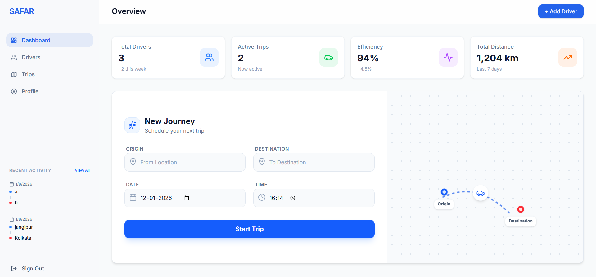

# SAFAR - Fleet Management Web App

A modern, mobile-first React application for car owners to manage drivers, track trips, and monitor their logistics operations. Built with React, Vite, Tailwind CSS, and Supabase.



## Features

- **Dashboard**: Overview of active trips and recent activity.
- **Driver Management**: Add, edit, and delete drivers.
- **Trip Tracking**: Log trips, assign drivers, and view history.
- **Profile Management**: Manage account details and subscription status.
- **Security**: Row Level Security (RLS) ensures data privacy for every owner.
- **Mobile First**: Fully responsive design optimized for phones and tablets.

## Tech Stack

- **Frontend**: React 18, Vite, TypeScript
- **Styling**: Tailwind CSS v4, Lucide React
- **State Management**: Zustand
- **Backend**: Supabase (Auth, Database, RLS)
- **Routing**: React Router 7

## Getting Started

### Prerequisites

- Node.js (v18 or higher)
- Supabase Account

### Setup

1.  **Clone the repository**:
    ```bash
    git clone https://github.com/your-username/safar-web.git
    cd safar-web
    ```

2.  **Install dependencies**:
    ```bash
    npm install
    ```

3.  **Configure Environment**:
    Copy `.env.example` to `.env`:
    ```bash
    cp .env.example .env
    ```
    Update `.env` with your Supabase credentials:
    ```env
    VITE_SUPABASE_URL=https://your-project.supabase.co
    VITE_SUPABASE_ANON_KEY=your-anon-key
    ```

4.  **Database Migration**:
    Run the SQL script found in `supabase/migrations/20240101_safar_schema.sql` in your Supabase SQL Editor to set up the tables and RLS policies.

5.  **Run Locally**:
    ```bash
    npm run dev
    ```

## Project Structure

```text
src/
 ├─ app/           # Layouts and Routes
 ├─ components/    # Reusable UI components
 ├─ features/      # Feature modules (Auth, Dashboard, Drivers, Trips)
 ├─ lib/           # Supabase client
 ├─ pages/         # Top-level pages
 └─ store/         # Global state (Zustand)
```

## Deployment

To build for production:

```bash
npm run build
```

Deployed easily on Vercel or Netlify.
